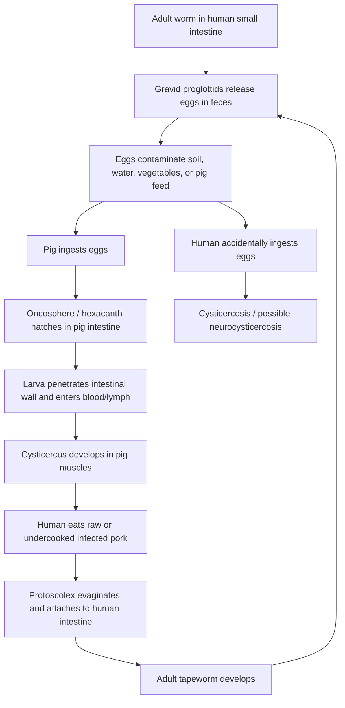
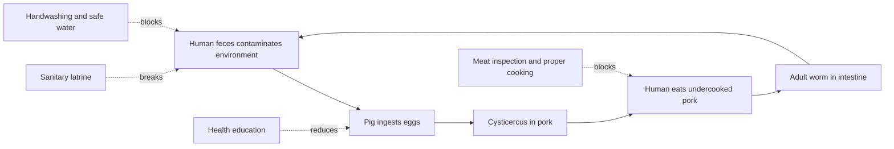

# Taenia solium (ফিতা কৃমি): জীবনচক্র এবং পরজীবীয় অভিযোজন

**Core idea:** *Taenia solium* হলো Platyhelminthes পর্বের Cestoda শ্রেণির একটি দেহচ্যাপ্টা, ফিতার মতো, অন্ত্রবাসী পরজীবী। এর জীবনচক্র বুঝতে হলে তিনটি বিষয় একসাথে ধরতে হবে: **মানুষ**, **শুকর**, এবং **পরিবেশে ছড়িয়ে পড়া ডিম/অনকোস্ফিয়ার**।

## 1. Concept Overview

জীববিজ্ঞানে পরজীবী বা **parasite** হলো এমন জীব, যারা বেঁচে থাকার জন্য অন্য জীবের দেহে বা দেহের উপর নির্ভর করে এবং সাধারণত পোষকের ক্ষতি করে। *Taenia solium* বা শুকরের ফিতা কৃমি একটি **digenetic parasite**, কারণ এর জীবনচক্র সম্পন্ন করতে দুই ধরনের পোষকের ভূমিকা প্রয়োজন।

- **Definitive / final host:** মানুষ; মানুষের ক্ষুদ্রান্ত্রে পূর্ণাঙ্গ ফিতা কৃমি বাস করে এবং যৌন প্রজনন করে।
- **Intermediate host:** সাধারণত শুকর; শুকরের পেশীতে লার্ভা **cysticercus** দশা তৈরি হয়।
- **Accidental intermediate host:** মানুষ নিজেও *T. solium* ডিম গ্রহণ করলে cysticercosis বা neurocysticercosis-এর ঝুঁকিতে পড়ে।

> **Important correction:** শুকরের দেহে *Taenia solium* সাধারণত অযৌনভাবে সংখ্যাবৃদ্ধি করে না; বরং ডিম থেকে বের হওয়া অনকোস্ফিয়ার শুকরের পেশীতে গিয়ে **cysticercus larva**-তে রূপান্তরিত হয়।

## 2. Why This Matters

*Taenia solium* একটি ছোট পরজীবী হলেও এর জীবনচক্রের ভেতরে Biology, public health, food hygiene, sanitation, host-parasite interaction এবং religious-ethical discipline—সবকিছুর সংযোগ দেখা যায়। মানুষ কাঁচা বা অর্ধসিদ্ধ সংক্রমিত শুকরের মাংস খেলে অন্ত্রে adult worm তৈরি হতে পারে, যাকে **taeniasis** বলা হয়। অন্যদিকে, কেউ যদি *T. solium* ডিম গ্রহণ করে, তাহলে larval cyst শরীরের পেশী, চোখ বা মস্তিষ্কে তৈরি হতে পারে; এটিই **cysticercosis**। মস্তিষ্ক বা central nervous system আক্রান্ত হলে একে **neurocysticercosis** বলা হয়, যা seizure এবং গুরুতর স্নায়বিক জটিলতার কারণ হতে পারে।

স্বাস্থ্যবিজ্ঞানের দৃষ্টিতে এই জীবনচক্র আমাদের শেখায়: মানুষের মল যেন পরিবেশ ও খাদ্যশৃঙ্খলে না যায়, মাংস যেন যথাযথভাবে রান্না হয়, পানি ও শাক-সবজি যেন নিরাপদ হয়, এবং ব্যক্তিগত পরিচ্ছন্নতা যেন নিয়মিত মানা হয়। বিশ্বাসভিত্তিক জীবনের ক্ষেত্রে একজন মুসলিম শিক্ষার্থীর জন্য হালাল খাদ্যাভ্যাস ও পবিত্রতার অনুশাসন এখানে একটি শক্তিশালী preventive framework হিসেবে বোঝা যায়।

## 3. Key Words First

| Term | Bengali meaning | Learning use |
|---|---|---|
| Digenetic parasite | দুই পোষক নির্ভর পরজীবী | জীবনচক্র বোঝার মূল ধারণা |
| Definitive host | চূড়ান্ত পোষক | যেখানে adult worm যৌন প্রজনন করে |
| Intermediate host | মধ্যবর্তী পোষক | যেখানে larval stage বিকশিত হয় |
| Gravid proglottid | ডিমপূর্ণ পরিপক্ব খণ্ড | ডিম পরিবেশে ছড়ায় |
| Oncosphere / Hexacanth | ছয়-হুকযুক্ত ভ্রূণ | অন্ত্র ভেদ করে টিস্যুতে যায় |
| Cysticercus | bladder worm larva | শুকরের পেশী বা accidental human tissue stage |
| Taeniasis | intestinal adult worm infection | adult worm মানুষের অন্ত্রে |
| Cysticercosis | larval tissue infection | ডিম খেলে larva মানুষের টিস্যুতে |
| Neurocysticercosis | CNS cysticercosis | brain/CNS আক্রান্ত হলে |
| Tegument | দেহের বাইরের শোষক আবরণ | পুষ্টি শোষণ ও সুরক্ষা |

---

## 4. LOLO: Learning Objectives & Learning Outcomes

### 4.1 Learning Objectives

এই পাঠ শেষে শিক্ষার্থী শিখবে:

1. *Taenia solium*-এর taxonomic position, host requirement এবং digenetic life cycle ব্যাখ্যা করতে।
2. capsule / egg → oncosphere / hexacanth → cysticercus → adult worm—এই ধারাবাহিকতা ব্যাখ্যা করতে।
3. মানুষ definitive host এবং শুকর intermediate host কেন, তা জীবনচক্রের প্রমাণ দিয়ে দেখাতে।
4. taeniasis ও cysticercosis-এর মধ্যে প্রধান পার্থক্য নির্ণয় করতে।
5. কেন cysticercosis, বিশেষত neurocysticercosis, intestinal taeniasis-এর চেয়ে বেশি ঝুঁকিপূর্ণ হতে পারে তা বিশ্লেষণ করতে।
6. খাদ্যাভ্যাস, sanitation, hand hygiene, safe water, meat inspection এবং public health-এর সাথে পরজীবী নিয়ন্ত্রণের সম্পর্ক স্থাপন করতে।
7. *T. solium*-এর parasitic adaptation—tegument, scolex, suckers, hooks, absent digestive system, high reproductive capacity—মূল্যায়ন করতে।
8. ধর্মীয় খাদ্যনীতি, পরিচ্ছন্নতা এবং scientific prevention-এর মধ্যে Synaptic Bridge তৈরি করতে।

### 4.2 Learning Outcomes

By the end of this page, learners will be able to:

- একটি পূর্ণাঙ্গ flowchart এঁকে *Taenia solium*-এর জীবনচক্রে মানুষ, শুকর ও পরিবেশের ভূমিকা ব্যাখ্যা করতে পারবে।
- cysticercusযুক্ত pork খেলে কেন taeniasis হয় এবং egg-contaminated food/water খেলে কেন cysticercosis হয় তা আলাদা করে বুঝাতে পারবে।
- definitive host, intermediate host এবং accidental intermediate host-এর পার্থক্য উদাহরণসহ লিখতে পারবে।
- stool examination, clinical suspicion, imaging, এবং চিকিৎসকের পরামর্শের প্রয়োজনীয়তা ব্যাখ্যা করতে পারবে।
- safe cooking, sanitary latrine, handwashing, safe water, vegetable washing এবং pig management—এই control points ব্যবহার করে জীবনচক্র ভাঙার strategy লিখতে পারবে।
- digestive system না থাকা সত্ত্বেও *Taenia solium* কীভাবে tegument দিয়ে host থেকে nutrient absorption করে, তা structural adaptation হিসেবে বিশ্লেষণ করতে পারবে।
- একটি critical public-health argument তৈরি করতে পারবে: “পরিচ্ছন্নতা ভাঙলে পরজীবীর জীবনচক্র চালু হয়; পরিচ্ছন্নতা বজায় রাখলে জীবনচক্র ভেঙে যায়।”

### 4.3 Constructive Alignment

| Learning Target | Content Focus | Activity | Assessment |
|---|---|---|---|
| Life cycle tracing | Egg, oncosphere, cysticercus, adult | Flowchart drawing | Label the stages |
| Host role analysis | Human, pig, environment | Host-stage table | Explain definitive vs intermediate host |
| Disease comparison | Taeniasis vs cysticercosis | Compare-and-contrast writing | Short answer |
| Adaptation evaluation | Tegument, scolex, high fecundity | Adaptation card sorting | Analytical question |
| Prevention logic | Sanitation, cooking, handwashing | Break-the-cycle diagram | Public-health application |
| Synaptic Bridge | Hygiene, food choice, ethics | Reflection paragraph | Critical-thinking response |

---

## 5. LALA: Learning Activities & Learning Applications

### 5.1 Learning Activities

1. **Life-cycle sketching:** একটি কাগজে মানুষ, শুকর এবং পরিবেশ—এই তিনটি zone তৈরি করে capsule/egg, oncosphere, cysticercus এবং adult worm কোথায় থাকে তা চিহ্নিত করো।
2. **Flowchart tracing:** নিচের Mermaid flowchart দেখে নিজের ভাষায় সাত ধাপ লিখো। প্রতিটি ধাপে infection route লিখবে: fecal contamination, pig ingestion, undercooked pork, বা egg ingestion।
3. **Disease comparison:** Taeniasis এবং cysticercosis-এর মধ্যে ৫টি পার্থক্য লিখো: infective stage, location, risk, symptom pattern, prevention.
4. **Adaptation audit:** Scolex, hook, sucker, tegument, absent gut, high egg production—এই ছয়টি adaptation-এর survival value লিখো।
5. **Public-health campaign:** “স্যানিটারি ল্যাট্রিন + হাত ধোয়া + ভালোভাবে রান্না” এই তিনটি বার্তা নিয়ে ৬০ শব্দের সচেতনতা পোস্টার তৈরি করো।
6. **Critical reflection:** “শুধু ব্যক্তিগত খাদ্যাভ্যাস নয়, community sanitation-ও কেন parasitic disease control-এর কেন্দ্র?”—এই প্রশ্নের উত্তর দাও।

### 5.2 Learning Applications

- **Health education:** গ্রামীণ বা semi-urban community-তে human feces যেন pig feed বা soil/water contamination-এর উৎস না হয়, সেই সচেতনতা তৈরি করা।
- **Food safety:** meat inspection, safe cooking temperature, and avoiding raw/undercooked pork—এই practice-গুলো disease prevention-এর সাথে যুক্ত করা।
- **Personal hygiene:** toilet ব্যবহারের পর, খাবার তৈরির আগে, এবং শিশু পরিচর্যার পরে হাত ধোয়ার অভ্যাস গড়ে তোলা।
- **Clinical awareness:** পেটে ব্যথা, ওজন কমা, stool-এ segment দেখা, seizure, visual disturbance বা neurological symptom থাকলে self-medication না করে চিকিৎসকের পরামর্শ নেওয়া।
- **Religious-practical connection:** halal food discipline এবং cleanliness-কে শুধু ritual হিসেবে নয়, disease-cycle prevention framework হিসেবেও বোঝা।
- **Critical citizenship:** sanitation infrastructure, safe water, livestock management, and health education—এসবকে Biology-এর applied public-health extension হিসেবে দেখা।

---

## 6. Diagram: Host–Stage Map

  

    <h3>Human: Definitive Host</h3>
    
Adult worm in small intestine

    
Gravid proglottids release eggs in feces

  

  
→

  

    <h3>Environment</h3>
    
Eggs / oncospheres contaminate soil, water, food

    
Sanitation decides whether the cycle continues

  

  
→

  

    <h3>Pig: Intermediate Host</h3>
    
Oncosphere penetrates gut wall

    
Cysticercus develops in muscle

  

  
→

  

    <h3>Human Infection</h3>
    
Undercooked infected pork → taeniasis

    
Egg ingestion → cysticercosis risk

  

---

## 7. Flowchart: Life Cycle of *Taenia solium*

**Flowchart reading rule:**

- **Cysticercusযুক্ত pork খাওয়া → intestinal taeniasis.**
- **Egg-contaminated food/water/hand ingestion → cysticercosis.**

---

## 8. Life Cycle: Step-by-Step Explanation

### 8.1 Adult worm in human intestine

মানুষের ক্ষুদ্রান্ত্রে পূর্ণাঙ্গ *Taenia solium* scolex-এর sucker ও hook দিয়ে অন্ত্রের দেয়ালে আটকে থাকে। দেহটি অসংখ্য proglottid দিয়ে গঠিত। পরিণত proglottid-এ reproductive organs থাকে এবং gravid proglottid-এ অসংখ্য ডিম জমা হয়।

### 8.2 Egg and gravid proglottid release

Gravid proglottid বা egg মানুষের মলের সাথে পরিবেশে বের হয়। sanitation দুর্বল হলে এগুলো soil, water, vegetable, pig feed অথবা হাতের মাধ্যমে খাদ্যশৃঙ্খলে ঢুকে পড়ে।

### 8.3 Oncosphere / hexacanth formation

ডিমের ভেতরে ছয় hook-যুক্ত embryo থাকে, যাকে **hexacanth embryo** বা **oncosphere** বলা হয়। “Hexa” মানে ছয়; তাই ছয় hook life-cycle invasion-এর জন্য গুরুত্বপূর্ণ।

### 8.4 Pig infection

শুকর যদি contaminated food, soil বা human feces গ্রহণ করে, ডিম pig intestine-এ hatch করে। oncosphere intestinal wall ভেদ করে blood বা lymph pathway দিয়ে skeletal muscle, tongue, neck, shoulder বা heart muscle-এ যেতে পারে।

### 8.5 Cysticercus / bladder worm formation

পেশীতে larva একটি fluid-filled bladder-like stage তৈরি করে, যাকে **cysticercus** বলা হয়। এই cysticercus-এ inverted scolex থাকে। মাংসে এই cysticerci থাকলে তা measly pork হিসেবে দেখা যেতে পারে।

### 8.6 Human taeniasis

মানুষ raw বা undercooked infected pork খেলে cysticercus মানুষের intestine-এ পৌঁছে। scolex evaginate করে intestinal wall-এ attach করে। তারপর neck region থেকে নতুন proglottid তৈরি হয়ে adult worm হয়।

### 8.7 Human cysticercosis: accidental route

যদি মানুষ *T. solium* ডিম গ্রহণ করে—contaminated food, water, unwashed hands, বা autoinfection-এর মাধ্যমে—তাহলে মানুষ accidental intermediate host-এর মতো কাজ করতে পারে। তখন larval cyst tissue, eye, muscle, বা brain/CNS-এ যেতে পারে।

---

## 9. Disease Logic: Taeniasis vs Cysticercosis

| Feature | Taeniasis | Cysticercosis |
|---|---|---|
| Infective stage for human | Cysticercus in undercooked pork | Eggs / oncospheres from fecal contamination |
| Main site | Small intestine | Muscle, eye, brain, CNS, other tissues |
| Parasite form | Adult worm | Larval cyst / cysticercus |
| Common severity | Often mild or asymptomatic | Can be serious, especially in CNS |
| Major danger | Nutrition loss, abdominal discomfort, proglottid passage | Seizure, visual damage, neurological complications |
| Prevention focus | Safe meat cooking | Sanitation, handwashing, safe water, vegetable washing |
| Medical response | Diagnosis and antihelminthic treatment under care | Imaging/clinical diagnosis; specialist treatment may be needed |

**Medical safety note:** এই পাঠ চিকিৎসা-পরামর্শ নয়। Taeniasis বা cysticercosis সন্দেহ হলে self-medication না করে qualified physician / healthcare provider-এর পরামর্শ নেওয়া উচিত। Neurocysticercosis-এর ক্ষেত্রে anti-parasitic drug, anti-inflammatory drug, seizure control, বা surgery—সবকিছু specialist supervision-এ নির্ধারিত হয়।

---

## 10. Pathogenicity and Control Measures

### 10.1 Taeniasis

Adult worm মানুষের intestine-এ থাকলে taeniasis হয়। অনেক ক্ষেত্রে symptom কম বা অনুপস্থিত থাকতে পারে। তবে abdominal pain, upset stomach, appetite change, weight loss, proglottid passage, digestive discomfort ইত্যাদি দেখা যেতে পারে।

### 10.2 Cysticercosis

*T. solium* ডিম খেলে larva body tissue-তে cyst তৈরি করতে পারে। Cyst brain বা CNS-এ গেলে neurocysticercosis হতে পারে, যা seizure, headache, neurological sign, বা long-term complication-এর কারণ হতে পারে।

### 10.3 Prevention: Break the Cycle

**Control points:**

1. স্যানিটারি ল্যাট্রিন ব্যবহার।
2. toilet ব্যবহারের পর এবং খাবার তৈরির আগে সাবান দিয়ে হাত ধোয়া।
3. ফল ও শাক-সবজি ভালোভাবে ধোয়া/নিরাপদ পানি ব্যবহার।
4. raw বা undercooked pork বর্জন।
5. meat inspection ও safe cooking practice।
6. pig যেন human feces-এর সংস্পর্শে না আসে।
7. infection সন্দেহ হলে proper diagnosis and treatment.

---

## 11. Parasitic Adaptation of *Taenia solium*

### 11.1 Ribbon-like flat body

দেহ ফিতার মতো লম্বা ও চ্যাপ্টা। এতে intestine-এর lumen-এ অবস্থান করা সহজ হয় এবং surface area বৃদ্ধি পায়, যা absorption-এর জন্য সহায়ক।

### 11.2 Scolex, sucker, and hook

Scolex হলো attachment organ. Sucker ও hook intestinal wall-এ ধরে থাকতে সাহায্য করে, ফলে intestinal movement বা peristalsis সত্ত্বেও worm সহজে বের হয়ে যায় না।

### 11.3 Tegument: living absorptive shield

*T. solium*-এর digestive system নেই। এটি tegument দিয়ে host intestine-এর nutrient সরাসরি শোষণ করে। Tegument একইসাথে protective covering এবং absorptive surface।

### 11.4 High reproductive output

Proglottid-based body plan parasite-কে প্রচুর egg উৎপাদনে সাহায্য করে। পরিবেশে অনেক egg ছড়ানো survival probability বাড়ায়।

### 11.5 Anaerobic tendency and host dependence

Intestinal environment-এ oxygen কম থাকতে পারে। Cestodes host-derived nutrient ব্যবহার করে low-energy lifestyle-এ বেঁচে থাকতে অভিযোজিত।

### 11.6 Reduction as adaptation

Digestive system না থাকা “অবনতি” মনে হলেও parasitic lifestyle-এ এটি energy-saving specialization। যখন host already digested nutrient দেয়, তখন নিজস্ব digestive tube রাখার প্রয়োজন কমে যায়।

---

## 12. Synaptic Bridge

বিজ্ঞান আমাদের দেখায় যে *Taenia solium*-এর জীবনচক্র সম্পূর্ণ হতে মানুষ, শুকর, পরিবেশ ও খাদ্যাভ্যাসের একটি অস্বাস্থ্যকর সংযোগ প্রয়োজন। যদি human feces পরিবেশে না যায়, যদি pig contaminated material না খায়, যদি মানুষ raw বা undercooked infected pork না খায়, তাহলে জীবনচক্র ভেঙে যায়।

একজন মুসলিম শিক্ষার্থীর জন্য এখানে একটি গুরুত্বপূর্ণ Synaptic Bridge আছে: ইসলামে শুকরের মাংস ভক্ষণ নিষিদ্ধ এবং পরিচ্ছন্নতাকে অত্যন্ত গুরুত্ব দেওয়া হয়েছে। Biology-এর দৃষ্টিতে halal food discipline, sanitation, hand hygiene এবং environmental cleanliness—এসব একসাথে disease-cycle interruption-এর practical framework হিসেবে দেখা যায়।

মানুষের প্রতিদিনের সিদ্ধান্ত—আমরা কী খাই, কীভাবে রান্না করি, কীভাবে মল ব্যবস্থাপনা করি, কীভাবে হাত ধুই, এবং কীভাবে পরিবেশ রক্ষা করি—এসব সিদ্ধান্ত সরাসরি দেহের স্বাস্থ্য, community health এবং প্রকৃতির ভারসাম্যের সাথে যুক্ত।

---

## 13. Critical Thinking Questions

1. *Taenia solium*-এর digestive system নেই, তবুও এটি মানুষের intestine-এ বেঁচে থাকে। parasitic adaptation-এর দৃষ্টিতে digestive system হারানোকে আপনি “উন্নতি”, “অবনতি”, নাকি “specialized reduction” বলবেন? যুক্তি দিন।
2. যদি কোনো সমাজে স্যানিটারি ল্যাট্রিনের ব্যবহার ১০০% নিশ্চিত করা যায়, তবে undercooked pork খাওয়ার অভ্যাস থাকলেও life cycle কতটা ভাঙা যাবে? human fecal contamination ছাড়া pig infection কীভাবে কমবে?
3. Taeniasis এবং cysticercosis—দুটি রোগের মধ্যে কোনটি public health-এর জন্য বেশি বিপজ্জনক? infective stage, transmission route, এবং organ involvement দিয়ে ব্যাখ্যা করুন।
4. ধর্মীয় খাদ্যনীতি, safe cooking, sanitation, and handwashing—এই চারটি স্তম্ভ কীভাবে একই disease-prevention model-এর অংশ হতে পারে?
5. “A parasite is biologically simple but strategically intelligent”—এই বক্তব্যটি *T. solium*-এর দেহগঠন ও জীবনচক্র দিয়ে মূল্যায়ন করুন।

---

## 14. Quick Revision Table

| Question | One-line answer |
|---|---|
| Definitive host কে? | মানুষ |
| Intermediate host কে? | সাধারণত শুকর |
| Adult worm কোথায় থাকে? | মানুষের ক্ষুদ্রান্ত্র |
| Cysticercus কোথায় থাকে? | শুকরের পেশী; accidental human tissue-তেও হতে পারে |
| Taeniasis কীভাবে হয়? | cysticercusযুক্ত undercooked pork খেলে |
| Cysticercosis কীভাবে হয়? | *T. solium* egg খেলে |
| Most dangerous form? | Neurocysticercosis, brain/CNS involvement হলে |
| Main prevention? | sanitation, handwashing, safe food/water, proper cooking, meat inspection |
| Digestive system আছে? | নেই; tegument দিয়ে nutrient absorption করে |

---

## 15. Learner Reflection / Comment Prompt

### Discussion Prompt

এই পাঠ পড়ে আপনার প্রশ্ন, confusion, অথবা reflection লিখে রাখুন:

1. জীবনচক্রের কোন ধাপটি আপনার কাছে সবচেয়ে গুরুত্বপূর্ণ control point মনে হয়েছে?
2. Taeniasis এবং cysticercosis-এর পার্থক্য বোঝাতে আপনি কোন diagram ব্যবহার করবেন?
3. Biology, hygiene, and ethics—এই তিনটি কীভাবে একসাথে public health তৈরি করে?

---

## 16. References and Verification Sources

- CDC. **About Human Tapeworm (Taeniasis)**. Updated June 13, 2024.
- CDC. **About Cysticercosis**. Updated September 4, 2024.
- WHO. **Taeniasis/cysticercosis** fact sheet.
- Standard Zoology / Parasitology textbooks used for morphology, host-stage terminology, and parasitic adaptation concepts.

