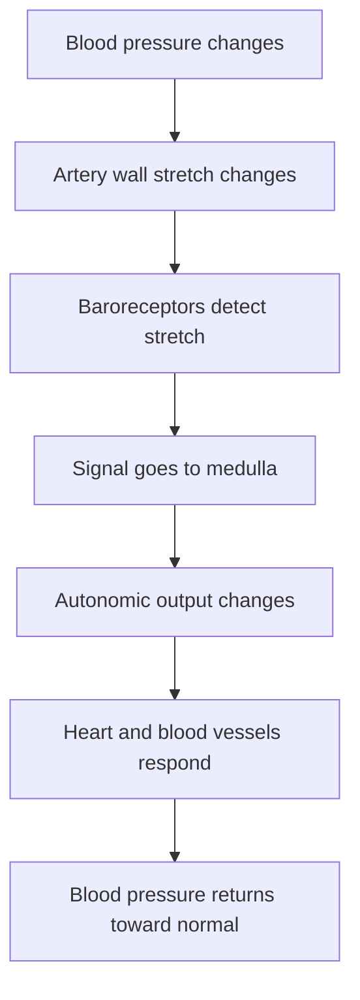

<div class="notice--info" markdown="1">

# Baroreceptor Reflex: Blood Pressure Control
## ব্যারোরিসেপ্টর রিফ্লেক্স: রক্তচাপ নিয়ন্ত্রণের দ্রুত ব্যবস্থা

**Core idea:** রক্তচাপ হঠাৎ বেড়ে বা কমে গেলে শরীর কয়েক সেকেন্ডের মধ্যে হৃদপিণ্ড ও রক্তনালীকে নির্দেশ দিয়ে চাপকে স্বাভাবিকের দিকে ফিরিয়ে আনে। এই দ্রুত নিয়ন্ত্রণ ব্যবস্থাই **Baroreceptor Reflex**।

</div>

## 1. Very Easy Start: Think Like a Water Pipe

একটি পানির পাইপ কল্পনা করো। পাইপে চাপ বেশি হলে পানি খুব জোরে বের হয়। চাপ কম হলে পানি দুর্বলভাবে বের হয়। যদি পাইপে একটি sensor থাকে, সে pump-কে বলবে: **“ধীরে চালাও”** অথবা **“জোরে চালাও”**।

আমাদের শরীরেও এমন pressure sensor আছে। এদের নাম **baroreceptor**।

- **Baro** = pressure/stretch
- **Receptor** = sensor
- **Baroreceptor** = pressure/stretch sensor

Baroreceptor সরাসরি শুধু সংখ্যায় pressure পড়ে না; artery wall কতটা stretch হচ্ছে, সেটি বুঝে brain-কে pressure সম্পর্কে signal পাঠায়।

---

## 2. LOLO: Learning Objectives & Learning Outcomes

### Learning Objectives

এই পাঠ শেষে শিক্ষার্থী শিখবে:

1. Baroreceptor কী এবং কোথায় থাকে।
2. Carotid sinus ও aortic arch কেন গুরুত্বপূর্ণ।
3. Blood pressure বেড়ে গেলে reflex কীভাবে pressure কমায়।
4. Blood pressure কমে গেলে reflex কীভাবে pressure বাড়ায়।
5. Sympathetic ও parasympathetic nervous system কীভাবে heart ও blood vessels নিয়ন্ত্রণ করে।
6. Baroreceptor reflex কেন short-term blood pressure control mechanism।

### Learning Outcomes

এই পাঠ শেষে শিক্ষার্থী পারবে:

- Baroreceptor reflex-এর receptor, afferent nerve, medulla, efferent nerve ও effector শনাক্ত করতে।
- High BP ও Low BP অবস্থায় heart rate, cardiac output ও peripheral resistance-এর পরিবর্তন ব্যাখ্যা করতে।
- Baroreceptor reflex-কে negative feedback হিসেবে বুঝাতে।
- MCQ, short question এবং application question-এর উত্তর দিতে।

---

## 3. Constructive Alignment

| Learning Target | Content Focus | Activity | Assessment |
|---|---|---|---|
| Baroreceptor চেনা | Carotid sinus, aortic arch | Diagram label | MCQ |
| Pathway বোঝা | CN IX, CN X, medulla | Flowchart tracing | Short answer |
| High BP response | Increased firing, decreased sympathetic output | Cause-effect table | Explain |
| Low BP response | Decreased firing, increased sympathetic output | Scenario analysis | Application |
| Critical thinking | Standing up suddenly | Predict response | Reasoning question |

---

## 4. Key Words First

| Term | Simple Meaning |
|---|---|
| Blood Pressure | রক্ত ধমনীর দেয়ালে যে চাপ দেয় |
| Baroreceptor | চাপ/টান শনাক্তকারী receptor |
| Carotid Sinus | গলার carotid artery-এর pressure sensor area |
| Aortic Arch | heart থেকে বের হওয়া বড় artery-এর বাঁকানো অংশ |
| Medulla | brainstem-এর autonomic control center |
| Sympathetic | pressure বাড়ানোর system |
| Parasympathetic | heart slow করার system |
| Vasoconstriction | রক্তনালী সরু হওয়া |
| Vasodilation | রক্তনালী প্রশস্ত হওয়া |
| Cardiac Output | প্রতি মিনিটে heart থেকে বের হওয়া blood volume |
| Total Peripheral Resistance | blood vessels-এর মোট resistance |

---

## 5. Basic Formula: Blood Pressure Depends on Two Big Things

Blood pressure মূলত দুইটি বিষয়ের উপর নির্ভর করে:

$$BP \approx Cardiac\ Output \times Total\ Peripheral\ Resistance$$

আর,

$$Cardiac\ Output = Heart\ Rate \times Stroke\ Volume$$

তাই শরীর blood pressure নিয়ন্ত্রণ করতে চাইলে সাধারণত তিন জায়গায় কাজ করে:

1. **Heart rate** বাড়ায় বা কমায়।
2. **Heart contraction** শক্তিশালী বা দুর্বল করে।
3. **Blood vessels** সরু বা প্রশস্ত করে।

---

## 6. Where Are Baroreceptors Located?

প্রধান arterial baroreceptor থাকে দুই জায়গায়।

### 6.1 Carotid Sinus

- অবস্থান: neck-এর carotid artery-এর bifurcation area
- কাজ: brain-এ blood supply-এর pressure বুঝতে সাহায্য করে
- nerve pathway: **Glossopharyngeal nerve, CN IX**

### 6.2 Aortic Arch

- অবস্থান: heart থেকে বের হওয়া aorta-এর arch অংশ
- কাজ: systemic arterial pressure monitor করে
- nerve pathway: **Vagus nerve, CN X**

সহজভাবে মনে রাখো:

> **Carotid sinus → CN IX**  
> **Aortic arch → CN X**

---

## 7. Reflex Arc: Full Pathway

Baroreceptor reflex একটি classic reflex arc।



| Part | Baroreceptor Reflex Example |
|---|---|
| Stimulus | Blood pressure rises or falls |
| Receptor | Baroreceptors in carotid sinus and aortic arch |
| Afferent path | CN IX and CN X |
| Control center | Medulla / NTS region |
| Efferent path | Sympathetic and parasympathetic nerves |
| Effectors | Heart, arterioles, veins |
| Response | Blood pressure corrected toward normal |

---

## 8. When Blood Pressure Rises

ধরো blood pressure suddenly বেড়ে গেল।

### Step-by-step

1. Artery wall বেশি stretch হয়।
2. Baroreceptors বেশি stimulated হয়।
3. Nerve impulse firing বেড়ে যায়।
4. Signal medulla-তে যায়।
5. Medulla sympathetic activity কমায়।
6. Parasympathetic/vagal activity বাড়ায়।
7. Heart rate কমে।
8. Heart contraction কমে।
9. Blood vessels dilate করে।
10. Blood pressure নিচে নেমে normal-এর দিকে যায়।

| Change | Result |
|---|---|
| BP increases | Artery stretch increases |
| Baroreceptor firing increases | Medulla receives more signal |
| Sympathetic output decreases | Vasodilation |
| Parasympathetic output increases | Heart rate decreases |
| Cardiac output decreases | BP falls |
| Peripheral resistance decreases | BP falls |

**One-line memory:**

> **High pressure → High firing → Heart slows → Vessels open → Pressure falls.**

---

## 9. When Blood Pressure Falls

ধরো তুমি হঠাৎ দাঁড়ালে। Gravity-এর কারণে কিছু blood নিচের দিকে চলে যায়। ফলে brain-এ blood flow কমতে পারে। শরীর দ্রুত response দেয়।

### Step-by-step

1. Blood pressure কমে।
2. Artery wall stretch কমে।
3. Baroreceptor firing কমে।
4. Medulla কম signal পায়।
5. Sympathetic activity বেড়ে যায়।
6. Parasympathetic/vagal activity কমে।
7. Heart rate বেড়ে যায়।
8. Heart contraction শক্তিশালী হয়।
9. Arterioles constrict করে।
10. Veins constrict করে venous return বাড়ায়।
11. Blood pressure normal-এর দিকে ফিরে আসে।

| Change | Result |
|---|---|
| BP decreases | Artery stretch decreases |
| Baroreceptor firing decreases | Medulla receives less signal |
| Sympathetic output increases | Vasoconstriction |
| Parasympathetic output decreases | Heart rate increases |
| Cardiac output increases | BP rises |
| Peripheral resistance increases | BP rises |

**One-line memory:**

> **Low pressure → Low firing → Sympathetic rises → Heart and vessels push pressure up.**

---

## 10. The Full Comparison

| Feature | Blood Pressure Rises | Blood Pressure Falls |
|---|---|---|
| Arterial stretch | Increases | Decreases |
| Baroreceptor firing | Increases | Decreases |
| Sympathetic output | Decreases | Increases |
| Parasympathetic output | Increases | Decreases |
| Heart rate | Decreases | Increases |
| Contractility | Decreases | Increases |
| Arterioles | Dilate | Constrict |
| Peripheral resistance | Decreases | Increases |
| Final effect | BP falls toward normal | BP rises toward normal |

---

## 11. Why Is It Called Negative Feedback?

Negative feedback মানে হলো: যে পরিবর্তন ঘটেছে, শরীর তার বিপরীত কাজ করে সেটিকে normal-এর দিকে ফিরিয়ে আনে।

- BP বেশি হলে শরীর BP কমায়।
- BP কম হলে শরীর BP বাড়ায়।

তাই baroreceptor reflex হলো **rapid negative feedback control system**।

---

## 12. Easy Story: Standing Up Suddenly

তুমি অনেকক্ষণ বসে ছিলে। হঠাৎ দাঁড়ালে।

1. Blood কিছুটা legs-এর দিকে চলে যায়।
2. Venous return কমে।
3. Cardiac output কমে।
4. Blood pressure কমে।
5. Baroreceptor firing কমে।
6. Sympathetic activity বাড়ে।
7. Heart rate বাড়ে।
8. Blood vessels constrict করে।
9. Brain আবার enough blood পায়।

তাই normal মানুষ সাধারণত দাঁড়ালেও অজ্ঞান হয়ে যায় না।

---

## 13. Clinical Importance

### 13.1 Postural Hypotension

হঠাৎ দাঁড়ালে যদি pressure যথেষ্ট দ্রুত correct না হয়, মাথা ঘোরা বা fainting হতে পারে। একে postural বা orthostatic hypotension বলা হয়।

### 13.2 Carotid Sinus Sensitivity

কিছু মানুষের carotid sinus খুব sensitive হতে পারে। Tight collar, shaving, বা neck pressure-এ reflex বেশি active হয়ে heart rate কমিয়ে dizziness বা syncope ঘটাতে পারে।

### 13.3 Hypertension

Baroreceptor reflex short-term control করে। Chronic hypertension-এ baroreceptor system নতুন higher pressure level-এর সাথে reset হতে পারে। তাই long-term blood pressure control-এ kidney, salt-water balance, and hormonal systems গুরুত্বপূর্ণ।

---

## 14. Common Mistakes

### Mistake 1: Baroreceptor pressure মাপে

Correction: Baroreceptor মূলত arterial wall stretch detect করে। Stretch থেকে pressure সম্পর্কে information পায়।

### Mistake 2: Baroreceptor long-term BP control করে

Correction: Baroreceptor reflex mostly short-term rapid control করে। Long-term control-এ kidney বেশি গুরুত্বপূর্ণ।

### Mistake 3: High BP হলে sympathetic বাড়ে

Correction: High BP হলে baroreceptor firing বাড়ে, medulla sympathetic output কমায়।

### Mistake 4: Low BP হলে heart slow হয়

Correction: Low BP হলে sympathetic বাড়ে, heart rate ও contractility বাড়ে।

---

## 15. LALA: Learning Activities & Learning Applications

### Activity 1: Complete the Chain

Fill in the blanks:

```text
Blood pressure rises → arterial stretch ______ → baroreceptor firing ______ → sympathetic output ______ → heart rate ______ → BP ______
```

Answer:

```text
increases → increases → decreases → decreases → decreases
```

### Activity 2: Predict the Response

Scenario: A student stands up suddenly and feels dizzy.

Question: Baroreceptor firing will increase or decrease?

Answer: It will decrease, because arterial stretch decreases when BP falls.

### Activity 3: One-Minute Teaching

Explain baroreceptor reflex to a friend using only these five words:

```text
Pressure → Sensor → Medulla → Nerves → Correction
```

---

## 16. Critical Thinking Questions

1. Why does heart rate increase when blood pressure falls?
2. Why does high blood pressure cause reflex bradycardia?
3. Why is baroreceptor reflex fast but not enough for long-term hypertension control?
4. Why are carotid sinus and aortic arch good places for pressure sensors?
5. Why can neck pressure sometimes cause fainting?

---

## 17. Exam-Focused Short Answer

### Question

What is baroreceptor reflex?

### Answer

Baroreceptor reflex is a rapid negative feedback mechanism that maintains arterial blood pressure. Baroreceptors in the carotid sinus and aortic arch detect stretch of arterial walls. Their impulses reach the medulla through glossopharyngeal and vagus nerves. The medulla then adjusts sympathetic and parasympathetic output to the heart and blood vessels. When blood pressure rises, heart rate and vascular resistance decrease; when blood pressure falls, heart rate and vascular resistance increase.

---

## 18. MCQ Practice

### 1. Baroreceptors mainly detect—

A. Blood glucose  
B. Arterial wall stretch  
C. Blood oxygen only  
D. Blood pH only  

**Answer: B. Arterial wall stretch**  
Explanation: Baroreceptors are stretch-sensitive mechanoreceptors.

---

### 2. Major arterial baroreceptors are located in—

A. Liver and spleen  
B. Carotid sinus and aortic arch  
C. Kidney tubules  
D. Pancreas and stomach  

**Answer: B. Carotid sinus and aortic arch**

---

### 3. Carotid sinus baroreceptor signals mainly travel through—

A. CN VII  
B. CN VIII  
C. CN IX  
D. CN XII  

**Answer: C. CN IX**

---

### 4. Aortic arch baroreceptor signals mainly travel through—

A. Vagus nerve  
B. Optic nerve  
C. Facial nerve  
D. Hypoglossal nerve  

**Answer: A. Vagus nerve**

---

### 5. When blood pressure rises, baroreceptor firing—

A. Increases  
B. Decreases  
C. Stops permanently  
D. Has no change  

**Answer: A. Increases**

---

### 6. High blood pressure through baroreceptor reflex causes—

A. Increased heart rate  
B. Reflex bradycardia  
C. Increased vasoconstriction  
D. Increased cardiac output  

**Answer: B. Reflex bradycardia**

---

### 7. When blood pressure falls, sympathetic activity—

A. Increases  
B. Decreases  
C. Stops  
D. Becomes irrelevant  

**Answer: A. Increases**

---

### 8. Baroreceptor reflex is best described as—

A. Long-term hormonal control  
B. Rapid negative feedback control  
C. Digestive reflex  
D. Respiratory gas exchange  

**Answer: B. Rapid negative feedback control**

---

## 19. Memory Card

```text
High BP → High stretch → High firing → ↓ Sympathetic + ↑ Vagus → ↓ HR + Vasodilation → BP falls

Low BP → Low stretch → Low firing → ↑ Sympathetic + ↓ Vagus → ↑ HR + Vasoconstriction → BP rises
```

---

## 20. Final Reflection

Baroreceptor reflex দেখায় যে শরীর শুধু structure নয়; শরীর একটি intelligent control system। রক্তচাপ একটু বাড়লেই বা কমলেই receptor, nerve, brainstem, heart, and blood vessels একসাথে কাজ করে। এই coordination-ই homeostasis।

**Learning Biology means learning control, balance, and purpose.**

---

## References Used

- Guyton and Hall Textbook of Medical Physiology — circulation and arterial pressure regulation.
- Uploaded physiology and zoology lecture collection — HSC/Zoology teaching sequence and Bengali explanatory style.
- NCBI Bookshelf / StatPearls — Physiology of Baroreceptors.
